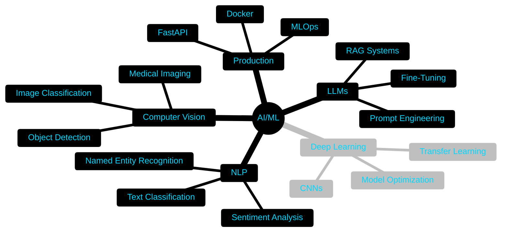

<div align="center">

<!-- Animated Wave Header -->


</div>

<!-- Animated Typing SVG -->
<p align="center">
  
</p>

<!-- Profile Views Counter with Animation -->
<p align="center">
  
</p>

---

<!-- About Me Section with GIF -->


### 👨‍💻 About Me

```python
class AIEngineer:
    def __init__(self):
        self.name = "Rohit Sharma"
        self.location = "Gurgaon, India 🇮🇳"
        self.role = "AI/ML Engineer"
        self.passion = "Building Intelligent Systems"
        
    def current_focus(self):
        return [
            "🤖 Large Language Models",
            "🔍 RAG Systems & Vector DBs",
            "👁️ Computer Vision",
            "⚡ Generative AI",
            "🏥 Healthcare AI",
            "💰 FinTech Solutions"
        ]
    
    def get_in_touch(self):
        return "Let's build something amazing! 🚀"
```

**🔗 Connect with me:**

<p align="left">
<a href="https://www.linkedin.com/in/rohit-sharma-36079b334/" target="_blank">
  
</a>&nbsp;
<a href="mailto:your.email@example.com" target="_blank">
  
</a>&nbsp;
<a href="https://github.com/rohitaimlpro" target="_blank">
  
</a>
</p>

<br clear="right"/>

---

<!-- Animated Separator -->


<!-- GitHub Stats Section - HIGHLIGHTED -->
<h2 align="center">📊 GitHub Statistics & Analytics</h2>

<div align="center">
  
<!-- Stats Cards Side by Side -->
<p align="center">
  
  
</p>

<!-- Language Stats -->
<p align="center">
  
</p>

<!-- Contribution Graph -->


<!-- Trophy Case -->
<p align="center">
  
</p>

</div>

---

<!-- Tech Stack Section -->
<h2 align="center">🛠️ Tech Stack & Tools</h2>

<div align="center">

### 💻 Languages
&nbsp;
&nbsp;


### 🤖 AI/ML Frameworks
&nbsp;
&nbsp;
&nbsp;


### 🦜 LLM & GenAI Tools
&nbsp;
&nbsp;
&nbsp;


### 🗄️ Databases & Vector Stores
&nbsp;
&nbsp;
&nbsp;


### ⚙️ Tools & Platforms
&nbsp;
&nbsp;
&nbsp;
&nbsp;


</div>

---

<!-- Animated Line -->


<!-- Featured Projects -->
<h2 align="center">🚀 Featured Projects</h2>

<div align="center">

<table>
<tr>
<td width="50%" valign="top">

### 🤖 LLM Fine-Tuning
[](https://github.com/rohitaimlpro/LLM-finetuning)

**Advanced techniques for domain-specific LLM optimization**
- 🔹 Custom model training & fine-tuning
- 🔹 LoRA & QLoRA implementations
- 🔹 Performance optimization strategies

</td>
<td width="50%" valign="top">

### 📚 RAG System with LangChain
[](https://github.com/rohitaimlpro/RAG-System-with-LangChain-and-FastAPI-)

**Production-ready Retrieval-Augmented Generation**
- 🔹 Vector embeddings & semantic search
- 🔹 FastAPI REST endpoints
- 🔹 Document QA capabilities

</td>
</tr>

<tr>
<td width="50%" valign="top">

### 🏥 Tuberculosis Detection
[](https://github.com/rohitaimlpro/Tuberculosis-detection)

**AI-powered medical image analysis**
- 🔹 Deep learning CNN models
- 🔹 Transfer learning techniques
- 🔹 High accuracy classification

</td>
<td width="50%" valign="top">

### 💰 AI Crypto Portfolio Tracker
[](https://github.com/rohitaimlpro/AI-Crypto-Portfolio-Tracker)

**Intelligent cryptocurrency portfolio management**
- 🔹 Real-time market tracking
- 🔹 AI-powered analytics & insights
- 🔹 Portfolio optimization algorithms

</td>
</tr>

<tr>
<td width="50%" valign="top">

### 🛍️ Product Pilot
[](https://github.com/rohitaimlpro/Product-Pilot)

**Smart product recommendation engine**
- 🔹 ML-based recommendation system
- 🔹 User behavior analysis
- 🔹 Personalization algorithms

</td>
<td width="50%" valign="top">

### 📊 Flipkart Sentiment Analysis
[](https://github.com/rohitaimlpro/Flipkart-Review-Sentiment-Analysis-Pipeline)

**Complete NLP pipeline for review analysis**
- 🔹 Sentiment classification models
- 🔹 Text preprocessing & tokenization
- 🔹 Insights & trend extraction

</td>
</tr>
</table>

</div>

---

<!-- Skills Visualization -->
<h2 align="center">💡 Core Competencies</h2>

<div align="center">



</div>

---

<!-- Current Focus & Learning -->
<h2 align="center">🌱 Current Focus & Goals</h2>

<div align="center">

<table>
<tr>
<td width="50%">

### 🎯 2025 Objectives
- ✅ Master advanced LLM architectures
- ✅ Build production-grade AI systems
- 🔄 Contribute to open-source AI projects
- 🔄 Publish AI research & articles
- 🔄 Develop multi-agent AI systems
- 🔄 Deep dive into MLOps practices

</td>
<td width="50%">

### 📚 Currently Learning
- 🧠 Advanced RAG techniques
- ⚡ Model optimization & quantization
- 🚀 LLM deployment at scale
- 🔐 AI safety & alignment
- 🌐 Distributed training systems
- 🤖 Autonomous AI agents

</td>
</tr>
</table>

</div>

---

<!-- Work Stats -->
<h2 align="center">⚡ Coding Activity</h2>

<div align="center">


<p align="center">
  
  
  
</p>

</div>

---

<!-- Quote Section -->
<div align="center">

<h2>💭 Developer Quote</h2>


</div>

---

<!-- Animated Line -->


<!-- Contact Section -->
<h2 align="center">🤝 Let's Connect & Collaborate</h2>

<div align="center">

<p align="center">
  <a href="https://www.linkedin.com/in/rohit-sharma-36079b334/">
    
  </a>&nbsp;&nbsp;
  <a href="mailto:your.email@example.com">
    
  </a>&nbsp;&nbsp;
  <a href="https://github.com/rohitaimlpro">
    
  </a>
</p>

### 💼 Open For:
✅ AI/ML Project Collaborations | ✅ Research Partnerships | ✅ Tech Consulting | ✅ Freelance Opportunities

</div>

---

<!-- Footer -->
<div align="center">


<h3>⭐ Thanks for visiting! Star some repos if you find them useful! ⭐</h3>

<p align="center">
  
</p>

**Made with ❤️ and lots of ☕**

</div>
