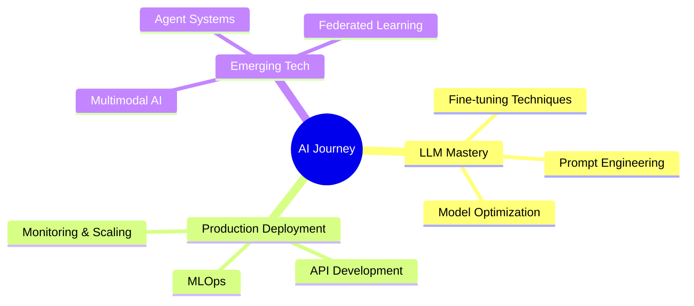

<div align="center">

# 🌟 Welcome to My Digital Universe 🌟


[](https://www.linkedin.com/in/rohit-sharma-36079b334/)
[](https://github.com/rohitaimlpro)
[](https://www.google.com/maps/place/Gurgaon)

</div>

---


### 🚀 About Me

```python
class AIEngineer:
    def __init__(self):
        self.name = "Rohit Sharma"
        self.role = "AI/ML Engineer"
        self.location = "Gurgaon, India"
        self.languages = ["Python", "SQL"]
        self.interests = [
            "Large Language Models",
            "Generative AI",
            "Computer Vision",
            "Healthcare AI",
            "FinTech & Crypto"
        ]
    
    def say_hi(self):
        print("Thanks for dropping by! Let's build something amazing together!")

me = AIEngineer()
me.say_hi()
```

<br clear="right"/>

---

## 🎯 What I Do

<div align="center">

| 🤖 LLMs & Gen AI | 🔍 RAG Systems | 👁️ Computer Vision |
|:---:|:---:|:---:|
| Fine-tuning & Optimization | LangChain & Vector DBs | Medical Image Analysis |
| Prompt Engineering | FastAPI Integration | Object Detection |
| Model Deployment | Document QA | Classification Models |

</div>

---

## 💼 Featured Projects

<div align="center">

<table>
<tr>
<td width="50%">

### 🤖 [LLM Fine-tuning](https://github.com/rohitaimlpro/LLM-finetuning)


**Advanced fine-tuning techniques for domain-specific LLMs**

🔹 Custom model training  
🔹 Performance optimization  
🔹 Domain adaptation  

</td>
<td width="50%">

### 📚 [RAG System](https://github.com/rohitaimlpro/RAG-System-with-LangChain-and-FastAPI-)


**Production-ready RAG with LangChain & FastAPI**

🔹 Vector embeddings  
🔹 Efficient retrieval  
🔹 REST API deployment  

</td>
</tr>

<tr>
<td width="50%">

### 🏥 [Tuberculosis Detection](https://github.com/rohitaimlpro/Tuberculosis-detection)


**AI-powered medical diagnosis system**

🔹 Deep learning models  
🔹 Medical imaging  
🔹 High accuracy detection  

</td>
<td width="50%">

### 💰 [AI Crypto Portfolio Tracker](https://github.com/rohitaimlpro/AI-Crypto-Portfolio-Tracker)


**Intelligent crypto portfolio management**

🔹 Real-time tracking  
🔹 AI-powered insights  
🔹 Portfolio optimization  

</td>
</tr>

<tr>
<td width="50%">

### 🛍️ [Product Pilot](https://github.com/rohitaimlpro/Product-Pilot)


**Smart product recommendation engine**

🔹 ML-based suggestions  
🔹 User behavior analysis  
🔹 Personalization  

</td>
<td width="50%">

### 📊 [Sentiment Analysis Pipeline](https://github.com/rohitaimlpro/Flipkart-Review-Sentiment-Analysis-Pipeline)


**E-commerce review analysis system**

🔹 NLP pipeline  
🔹 Sentiment classification  
🔹 Insights extraction  

</td>
</tr>
</table>

</div>

---

## 🛠️ Tech Arsenal

<div align="center">

### Languages & Frameworks


### AI/ML Tools


### Databases & Tools


</div>

---

## 📊 GitHub Analytics

<div align="center">
  
  
</div>

<div align="center">
  
</div>

<div align="center">
  
</div>

---

## 🏆 GitHub Trophies

<div align="center">
  
</div>

---

## 🌱 Current Focus

<div align="center">


```mermaid
mindmap
  root((AI Journey))
    LLM Mastery
      Fine-tuning Techniques
      Prompt Engineering
      Model Optimization
    Production Deployment
      MLOps
      API Development
      Monitoring & Scaling
    Emerging Tech
      Multimodal AI
      Agent Systems
      Federated Learning
```

</div>

---

## 💡 Philosophy

<div align="center">

> *"AI is not about replacing humans, it's about augmenting human potential."*


</div>

---

## 📈 Contribution Graph

<div align="center">
  
</div>

---

## 🎯 2025 Goals

- [ ] 🚀 Contribute to open-source LLM projects
- [ ] 📚 Publish research papers on AI applications
- [ ] 🎓 Complete advanced MLOps certifications
- [ ] 🤝 Collaborate with AI community worldwide
- [ ] 💼 Build production-grade AI products

---

## 🤝 Let's Connect & Collaborate

<div align="center">

[](https://www.linkedin.com/in/rohit-sharma-36079b334/)
[](mailto:your.email@example.com)
[](#)

### 💬 Open to:
✅ AI/ML Projects | ✅ Research Collaborations | ✅ Tech Discussions | ✅ Freelance Opportunities

</div>

---

<div align="center">

### 🌟 Show some ❤️ by starring some repositories! 🌟


**"Building the future, one commit at a time"** 🚀

</div>
