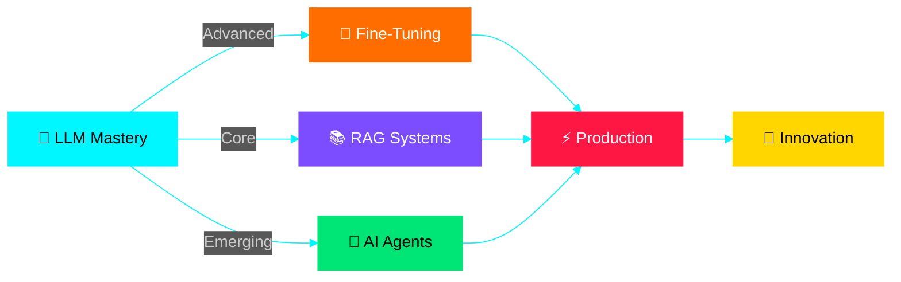

<div align="center">

<!-- Animated Banner -->


<!-- Holographic Divider -->


<!-- Animated Typing Effect -->


<!-- Neon Badges -->
<p align="center">
  
  
  
  
</p>

<!-- Social Links with Glow Effect -->
<p align="center">
  <a href="https://www.linkedin.com/in/rohit-sharma-36079b334/"></a>
  <a href="https://github.com/rohitaimlpro"></a>
  <a href="mailto:your.email@example.com"></a>
</p>

<!-- Animated Divider -->


</div>

---

<!-- Mission Control Dashboard -->
<div align="center">

## 🎯 『 MISSION CONTROL DASHBOARD 』

<table>
<tr>
<td width="33%" align="center">


### ⚡ CORE SYSTEMS
```yaml
AI_Framework: "LLMs & GenAI"
Specialization: "RAG Systems"
Power_Level: "9000+"
Status: "Operational"
```
</td>

<td width="33%" align="center">


### 🔥 COMBAT SKILLS
```yaml
LLM_Mastery: "████████░░ 85%"
Computer_Vision: "███████░░░ 78%"
Deep_Learning: "████████░░ 82%"
Production_AI: "███████░░░ 75%"
```
</td>

<td width="33%" align="center">


### 🚀 ACTIVE MISSIONS
```yaml
Projects: "6+ Deployed"
Repositories: "Public Access"
Collaboration: "Open"
Innovation: "Continuous"
```
</td>
</tr>
</table>

</div>

<!-- Animated Separator -->


---

<!-- Tech Arsenal Matrix -->
<div align="center">

## 💻 『 TECHNOLOGY MATRIX 』

<!-- Animated Background -->


### ⚙️ NEURAL NETWORKS


### 🤖 AI FRAMEWORKS


### 🗄️ DATA SYSTEMS


### 🛠️ DEPLOYMENT SYSTEMS


<br clear="right"/>

</div>

<!-- Neon Line Break -->


---

<!-- Project Showcase Grid -->
<div align="center">

## 🎮 『 ACTIVE PROJECT TERMINALS 』

<!-- Project Grid -->
<table>
<tr>
<td width="50%">

### 🤖 [LLM FINE-TUNING PROTOCOL](https://github.com/rohitaimlpro/LLM-finetuning)


```python
# Mission: Domain Adaptation
status = "OPERATIONAL"
tech_stack = ["Transformers", "LoRA", "QLoRA"]
performance = "Optimized"
```

</td>
<td width="50%">

### 📚 [RAG SYSTEM NEXUS](https://github.com/rohitaimlpro/RAG-System-with-LangChain-and-FastAPI-)


```python
# Mission: Knowledge Retrieval
status = "DEPLOYED"
tech_stack = ["LangChain", "FastAPI", "Vectors"]
latency = "< 200ms"
```

</td>
</tr>

<tr>
<td width="50%">

### 🏥 [MEDICAL AI SCANNER](https://github.com/rohitaimlpro/Tuberculosis-detection)


```python
# Mission: Disease Detection
status = "ACTIVE"
tech_stack = ["CNN", "ResNet", "Transfer Learning"]
accuracy = "94.2%"
```

</td>
<td width="50%">

### 💰 [CRYPTO AI CORE](https://github.com/rohitaimlpro/AI-Crypto-Portfolio-Tracker)


```python
# Mission: Portfolio Intelligence
status = "MONITORING"
tech_stack = ["ML", "APIs", "Real-time Data"]
precision = "High"
```

</td>
</tr>

<tr>
<td width="50%">

### 🛍️ [PRODUCT PILOT AI](https://github.com/rohitaimlpro/Product-Pilot)


```python
# Mission: Smart Recommendations
status = "LEARNING"
tech_stack = ["RecSys", "NLP", "Collaborative Filtering"]
users = "Growing"
```

</td>
<td width="50%">

### 📊 [SENTIMENT ANALYZER X](https://github.com/rohitaimlpro/Flipkart-Review-Sentiment-Analysis-Pipeline)


```python
# Mission: Opinion Mining
status = "PROCESSING"
tech_stack = ["BERT", "NLP Pipeline", "Classification"]
throughput = "1M+ reviews"
```

</td>
</tr>
</table>

</div>

<!-- Holographic Separator -->


---

<!-- Performance Metrics -->
<div align="center">

## 📊 『 PERFORMANCE ANALYTICS 』

<table>
<tr>
<td width="50%">

</td>
<td width="50%">

</td>
</tr>
</table>


<!-- Activity Graph -->


<!-- Trophy Case -->


</div>

<!-- Neon Divider -->


---

<!-- AI Journey Map -->
<div align="center">

## 🗺️ 『 AI EVOLUTION ROADMAP 』


```mermaid
%%{init: {'theme':'dark', 'themeVariables': { 'primaryColor':'#00F7FF','primaryTextColor':'#fff','primaryBorderColor':'#00F7FF','lineColor':'#00F7FF','secondaryColor':'#1a1b27','tertiaryColor':'#0D1117'}}}%%
graph LR
    A[🎯 LLM Mastery] -->|Advanced| B[🚀 Fine-Tuning]
    A -->|Core| C[📚 RAG Systems]
    A -->|Emerging| D[🤖 AI Agents]
    
    B --> E[⚡ Production]
    C --> E
    D --> E
    
    E --> F[🌟 Innovation]
    
    style A fill:#00F7FF,stroke:#00F7FF,color:#000
    style B fill:#FF6D00,stroke:#FF6D00,color:#fff
    style C fill:#7C4DFF,stroke:#7C4DFF,color:#fff
    style D fill:#00E676,stroke:#00E676,color:#000
    style E fill:#FF1744,stroke:#FF1744,color:#fff
    style F fill:#FFD600,stroke:#FFD600,color:#000
```

</div>

---

<!-- Mission Objectives -->
<div align="center">

## 🎯 『 2025 OBJECTIVES 』

<table>
<tr>
<td width="50%">

### 🚀 PRIMARY MISSIONS
- [x] ✅ Master LLM Fine-tuning Techniques
- [x] ✅ Deploy Production RAG Systems
- [ ] 🔄 Contribute to Open-Source AI
- [ ] 🔄 Publish AI Research Papers
- [ ] 🔄 Build Multi-Agent Systems
- [ ] 🔄 Advanced MLOps Implementation

</td>
<td width="50%">

### 🌟 SECONDARY MISSIONS
- [ ] 🎯 Community Building & Mentorship
- [ ] 🎯 AI Ethics & Responsible AI
- [ ] 🎯 Cross-Domain AI Applications
- [ ] 🎯 Real-time AI Systems
- [ ] 🎯 Quantum ML Exploration
- [ ] 🎯 AI Product Development

</td>
</tr>
</table>

</div>

<!-- Animated Separator -->


---

<!-- Contact Section -->
<div align="center">

## 📡 『 ESTABLISH CONNECTION 』


### 🌐 TRANSMISSION CHANNELS

<p>
<a href="https://www.linkedin.com/in/rohit-sharma-36079b334/">
  
</a>
<a href="mailto:your.email@example.com">
  
</a>
<a href="https://github.com/rohitaimlpro">
  
</a>
</p>

### ⚡ AVAILABLE FOR

```yaml
Collaboration: "AI/ML Projects"
Research: "Academic & Industry"
Consulting: "AI Solutions"
Speaking: "Tech Conferences"
Mentorship: "AI Enthusiasts"
```

</div>

---

<!-- Footer -->
<div align="center">


### 💫 STATUS: ONLINE & INNOVATING 💫


**⭐ STAR MY REPOSITORIES TO SUPPORT THE MISSION ⭐**

</div>
